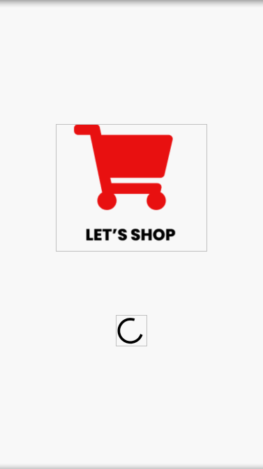
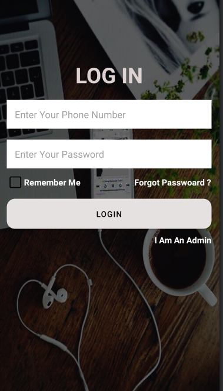
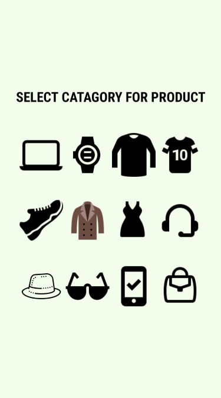
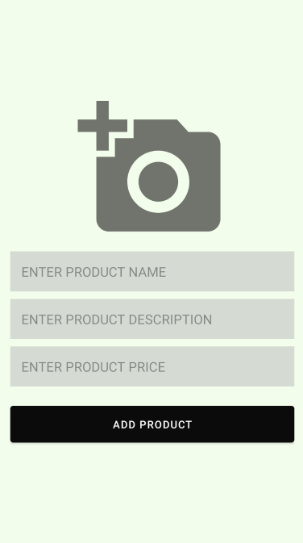
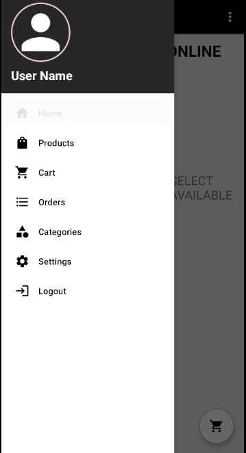
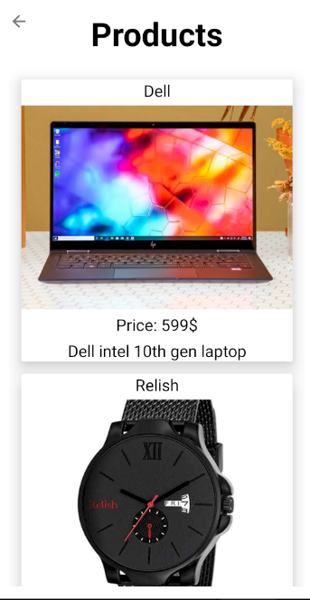

  

                                        

  <h1 align="center">Project Name: Shop Online</h1>
  <h2 align ="center">Course Number: CSE299 
  Section:03 
  Group:03 
  Semester: Fall 2020  
  Faculty Name: Shaikh Shawon Arefin Shimon</h2>
  <h3 align="center">Student Name: Md Abir Hossain 

  Student ID: 1731597042 
  Email: abir.hossain04@northsouth.edu   
  Date prepared: 21/01/2020</h3>   

<h2> Project Name: Shop Online </h2> 
<h3 id="table-of-contents">Table of contents</h3>

<ol>
  <a href="#introduction"><li>Introduction</li> </a>
  <a href="#features"><li>Features</li> </a>
  <a href="#Technology"><li>Technology</li> </a>
  <a href="#Design"><li>Monetization</li></a> 
  <a href="#Roadblocks"><li>Roadblocks</li></a> 
  <a href="#conclusion"><li>conclusion</li></a>  

</ol>
 

<h2 id="#introduction">1. Introduction</h2>
<h3>1.1 Project Idea:</h3>

In this modern global economy e-commerce platforms are getting more and more popular. Because e-commerce offers better marketing opportunities, more convenient, reduces cost and can make anyone’s business global. Here store remains open all the time. Users can order anything anytime, and it also have maximum security of transaction. Through this platform anyone can easily keep in touch with their customers.

I tried to make an android application which will have all the functionalities of a modern e-commerce platform. Here users will find their various types of products such as clothing, shoes, watch, computer/laptop, jewelry, vehicle etc. They will make their own account in this app and from their account they will be able to order these

<h2 id="features">2. Features</h2>
This project has the following features -
<!--user regestration-->
<h3>2.1 Splash Screen:</h3>
  At first user will see a splash screen which will load for some time
    
    
 

   
 

 <h3>2.2 Choose Option:</h3>
  Then users will get option to login or signup
    
    
 

   
 

<h3>2.3 User Registration:</h3>
  User must register if he/she does not have an account. Users must include name,phonenumber, password .
    
    
 

   
 

 <h3>2.4 User Login:</h3>
  User can login by providing phone number and passsword
    
    
 

   
 

 
 If the user is an Admin then after login he/she will see categories to add product 
  

   
 

  Then admins will give necessery information and add product 
   

  

  

<h3>2.5 Client Navbar:</h3>
  Clients will be able to see navbar in their homepage to go to different activities 
   

  

  

<h3>2.5 See products:</h3>
  Clients will be able to see products that are available 
   

  

  

<h3>2.6 Add to cart:</h3>
 Clients can click those products and see the details of those and also add them to cart 
 

 

<h3>2.7 Cart Items:</h3>
Clients can see cart items and total price. They can also delete item from cart  

  

<h3>2.9 Place Order:</h3>
Clients can place order by provoding necessary informations  

  

 <h2 id="#data">3.Data Management</h2>
 
For Data management i have used both firebase and sqlite. In this app firebase was widely used.Firebase is Google's mobile platform that helps you quickly develop high-quality apps and grow your business. This apps login registration is done by firebase authentication.Realtime Database is Firebase's original database. It's an efficient, low-latency solution for mobile apps that require synced states across clients in realtime. I used firebase realtime database to keep the user data. And for storing the images i used firebase storage.Cloud Storage for Firebase is a powerful, simple, and cost-effective object storage service built for Google scale. Sqlite was used to store the cart items that user was storing in his app 

<h2 id="#Design">4. Design Pattern</h2>

No design pattern was followed for making this app. Firebase database is a noSql database and it stores data in tree format.

<h2>5. Roadblocks</h2>

There are some roadblocks i had to face while making this app. First roadblock was google map integration. Google map does not give right location while working in emulator. So all the users and vendors are registering with same location for now. But when in mobile device it gets fixed. Then i faced a problem with resting passwor. Because I made a mistake while checking if its a correct email format. I did not use navigation drawer which i wanted to do. But could not do it becuse android got updated and now navigation activity comes with fragment. In search option i also faced some problem. While i was writing food category names the food was not appearing then i found out that my adapter name was wrong and fixed it. But still it has a problem i could not change the hints of the search as i give input into the search bar. And the last problem i faced today is showing the cart dialog to the client. In the logcat it shows me that i did not set adapter for my cart dialog but in code i did set the adapter. The app is not yet in a complete as i couldn't finish the ordering process. 
