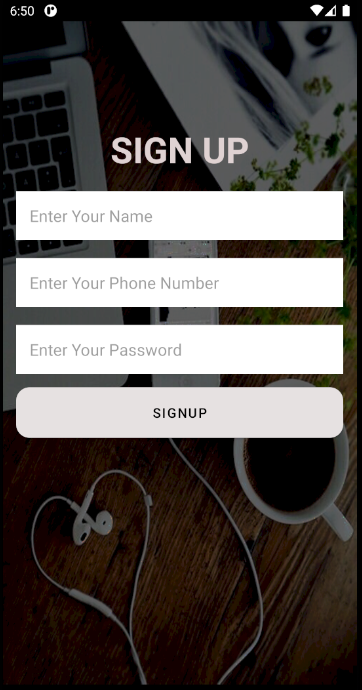
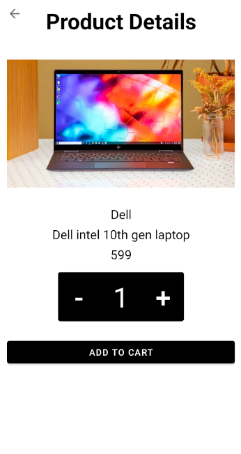
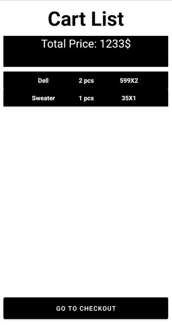
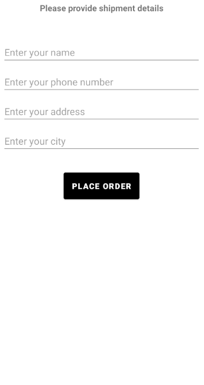

  

                                        

  <h1 align="center">Project Name: Shop Online</h1>
  <h2 align ="center">Course Number: CSE299 
  Section:03 
  Group:03 
  Semester: Fall 2020  
  Faculty Name: Shaikh Shawon Arefin Shimon</h2>
  <h3 align="center">Student Name: Md. Abir Hossain 

  Student ID: 1731597042 
  Email: abir.hossain04@northsouth.edu   
  Date prepared: 21/01/2020</h3>   

<h2> Project Name: Shop Online </h2> 
<h3 id="table-of-contents">Table of contents</h3>

<ol>
  <a href="#introduction"><li>Introduction</li> </a>
  <a href="#features"><li>Features</li> </a>
  <a href="#Technology"><li>Technology</li> </a>
  <a href="#Monetization"><li>Monetization</li></a> 
  <a href="#Roadblocks"><li>Roadblocks</li></a> 
  <a href="#conclusion"><li>conclusion</li></a>  

</ol>
 

<h2 id="#introduction">1. Introduction</h2>
<h3>1.1 Project Idea:</h3>

In this modern global economy e-commerce platforms are getting more and more popular. Because e-commerce offers better marketing opportunities, more convenient, reduces cost and can make anyone’s business global. Here store remains open all the time. Users can order anything anytime, and it also have maximum security of transaction. Through this platform anyone can easily keep in touch with their customers.

I tried to make an android application which will have all the functionalities of a modern e-commerce platform. Here users will find their various types of products such as clothing, shoes, watch, computer/laptop, jewelry, vehicle etc. They will make their own account in this app and from their account they will be able to order these

<h2 id="features">2. Features</h2>
This project has the following features -
<!--user regestration-->
<h3>2.1 Splash Screen:</h3>
  At first user will see a splash screen which will load for some time
    
    
 

   
 

 <h3>2.2 Choose Option:</h3>
  Then users will get option to login or signup
    
    
 

   
 

<h3>2.3 User Registration:</h3>
  User must register if he/she does not have an account. Users must include name,phonenumber, password .
    
    
 

   
 

 <h3>2.4 User Login:</h3>
  User can login by providing phone number and passsword
    
    
 

   
 

 
 If the user is an Admin then after login he/she will see categories to add product 
  

   
 

  Then admins will give necessery information and add product 
   

  

  

<h3>2.5 Client Navbar:</h3>
  Clients will be able to see navbar in their homepage to go to different activities 
   

  

  

<h3>2.5 See products:</h3>
  Clients will be able to see products that are available 
   

  

  

<h3>2.6 Add to cart:</h3>
 Clients can click those products and see the details of those and also add them to cart 
 

 

<h3>2.7 Cart Items:</h3>
Clients can see cart items and total price. They can also delete item from cart  

  

<h3>2.9 Place Order:</h3>
Clients can place order by provoding necessary informations  

  

 <h2 id="#Technology">3.Technology</h2>

 
For this app i used android studio as the IDE. I used java to handel item clicks and other views.Relative layout, linearlayout, recyclerview, and other android widgets were used. To design i used XML code

 
For Data management i have used firebase.No design pattern was followed for making this app. In this app firebase was widely used.Firebase is Google's mobile platform that helps you quickly develop high-quality apps and grow your business.Firebase database is a noSql database and it stores data in tree format. This apps login registration is done by firebase authentication.Realtime Database is Firebase's original database. It's an efficient, low-latency solution for mobile apps that require synced states across clients in realtime. I used firebase realtime database to keep the user data. And for storing the images i used firebase storage.Cloud Storage for Firebase is a powerful, simple, and cost-effective object storage service built for Google scale.

<h2 id="#Monetization">4. Monetization</h2>

The user will not pay any subscription fee to use this that means they will be able to use
it for free but I integrated google AdMob in this app. AdMob helps translate one’s hard
work into earnings, Google AdMob makes it easy for developers to earn money from their
app. That’s how the cost for developing this application will reimburse.

<h2>5. Roadblocks</h2>

There are some roadblocks i had to face while making this app. I faced most of the problem with navigation drawer. Android navigation drawer got updated and now the navigation drawer comes with fragmanents. I tried to implement recyclerView in fragment but could not do it. So i created a new activity to show products. While designing I also faced problem with elegent button library. But from manifest I was able to fix that problem. I cart activity my edit button is not working properly but delete button is working fine. In firebase i also faced some problem. At first while connecting firebase to my app i tried the old method which is copyiing the ssh1 code from my app and the paste it on firebase. Then the firebase was getting connected but the realtime database was not working though i added dependency in build.gradle(app). Then i created another new project and connected firebase from tools then it was working fine.Later on after a month i again faced another problem with realtime database because i opened the app in Test Mode which is and insecure mode where users get permission to read and write in the database. But google only allows this mode for one month. And was not allowing the users to login to the app or signup. Then i changed the realtime database rule manually and it started working just fine.  The app is not yet in a complete as i couldn't finish the order confirming process from admin panel. 
